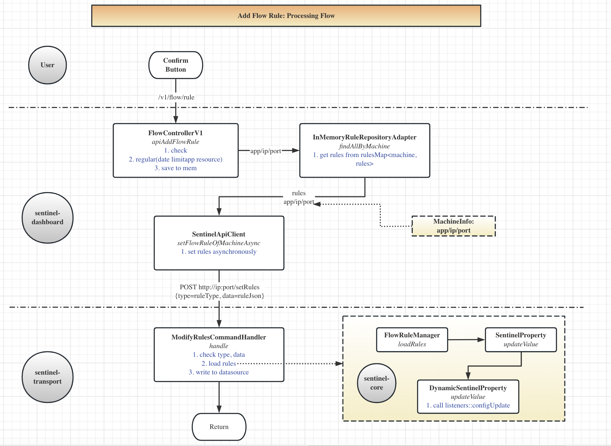

# Sentinel Nacos

## 相关信息

*

基于官方发布的 [sentinel-demo-spring-webmvc](https://github.com/alibaba/Sentinel/tree/master/sentinel-demo/sentinel-demo-spring-webmvc)

## 功能说明

* 通过sentinel-dashboard、nacos配置页面对配置的修改，可以实时的更新

## 设计

> 待补充

## 流程分析

> 添加流量规则的处理过程

